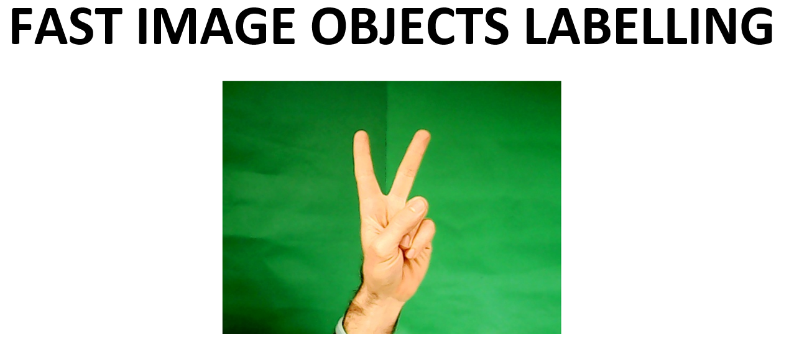
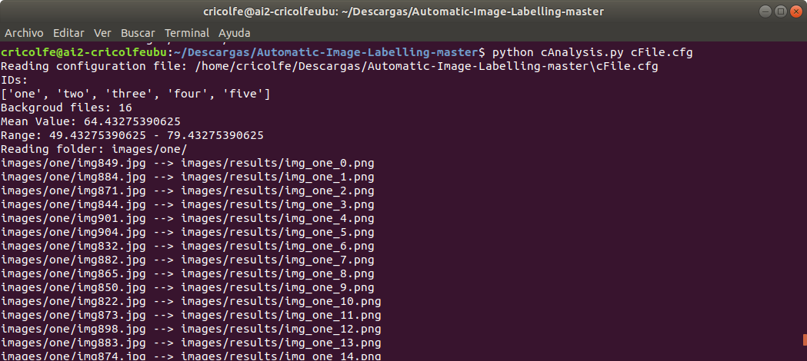

Manual image objects labelling is a very tedious and time consuming task. The aim of this toolbox is to facilitate the initial step of creating a set of labelled objects in images to train deep models. Here, images are captured under controlled background and objects are labelled easily using 2D computer vision techniques. Afterwards, detected objects are combined with images of standard backgrounds to create a rich image set to train deep models. 
Example is done using images that contains hands with fingers. Hands (objects) are labelled under five clases (one, thwo, three, four, five)
Results are ready to train a deep learning model using Tensorflow.

**Prerequisites:**
- opencv-python
- libconf
- python-tk
- pandas
- matplotlib
- :coffee: 
- :pizza:

```bash
$ pip install libconf
$ pip install opencv-python
$ sudo apt-get install python3-tk
$ pip install pandas
$ pip install matplotlib
```

## Step 1. Capturing and organizing images
Take images using cCapture.py with a webcam for example. It takes one image every 200 ms. Background of images have to be flat with no textures and color have to be different of objects to label. You can use a cardboard as background. A clear example is the image under the title.

Organize all images into classses according with the different sets you want to identify. To organize images with hands, folders with names *"one", "two", "three", "four", "five"* are created. Each folder has images of one class. There is also a folder with images of backgrounds to combine with images of classes called *"backgrounds"*. If this folder is empty, original images are not combined with backgrounds. Also, it is necessary an image of the backgound without objects to threshold image pixels and remove background. This image is called *"imbk.jpg"*. Results will be stored in another folder called *"results"*.  Following figure shows the set of folders to organize all images in classes and compute results. In folder */images* you have this structure with all hand images.


## Step 2. Configuring automatic object detection task
Configure image labelling task using file *"cFile.cfg"*. It is important to configure the HSV channel to threshold the image. It should be 0 for the Hue layer where colours are defined and 1 for Saturation layer. Background is removed as follow. First using the image  of background *"imbk.jpg"*, the mean value for H or S channel is computed according with the selected channel for thresholding. This value together with the threshold value defined with parameter *"threshold"*, establishes a band of background pixels. This value is used to threshold incoming images. All image labelling parameters are shown in the following image.


## Step 3. Object detection
Run the program *cAnalisys.py* with the configuration file *cFile.cfg*

```bash
$ python cAnalysis.py cFile.cfg
```

With parameter *WaitTime* set to 0, you can see how the algortihm is working with every image just pushing one key. With the HSV decomposition images, you can see which layer differentiate object pixels and background pixels better. In this case, H layer is the best one. With this information reconfigure the *"HSV channel"* and *"threshold"* parameters to select pixels.


Parameter *WaitTime* is waiting time between images. Set it to 10 and algorithm run with all images every 10 ms.



In the *images/results* folder, all combined images will appear. Also, the file with all features extracted from images *(allData.csv)* and *.xml* files with the same name of images with information of object ROI and the class that object belongs to. Furtherore, *.png* images with masks if they are necessary for mask detection. If you want to revise detected ROI you can open with any label editing program such as LabelImg for example.


## Step 4. Generate files to work with Tensorflow
To generate a *.record* file to work with tensorFlow, it is necessary two steps:

**4.1**

Information in *.xml* files is arranged in a unique *.cvs* file. Run *cXml_to_cvs.py* pointing to the folder where *.xml* files are. A *.cvs* file appears in the same folder with the name *all_labels.cvs*.

```bash
$	python cXml_to_csv.py images/results
```


**4.2**

*.cvs* file of step 4.1 is used to generate the *.record* file with *generate_tfrecord.py*. It is necessary to edit this code to replace the label map starting at line 31 with the label map used in the folder distribution of images defined in step 1. Each object is assigned an ID number. This number assignment will be used when configuring the labelmap.pbtxt file in next step.


Generate the TFRecord files by issuing the command:

```bash
$	python generate_tfrecord.py --csv_input=images/results/all_labels.csv --image_dir=images/results --output_path=images/results/train.record
```
As a result, a *train.record* file appears in the output_path folder. If you want to know how a record file is generated you can see more information in [creating record file](https://github.com/tensorflow/models/blob/master/research/object_detection/g3doc/using_your_own_dataset.md)

## Step 5. Generate files with MASKS to work with Tensorflow

In step 4.2 a *.record* file was generated. This *.record* file only contains information about ROIs but not about masks. To generate a file *.record* with all the image information including ROIs and masks, launch the program *cGenerate_tfrecord_masks.py*. Inputs of the program are:
- Path to the CSV input (csv_input) generated in step 4.1.
- Path to the label map (label_map_path). Instead of modifiying code as in step 4.2, here a file *"label_map.pbtxt"* is used as label map
-  Path to the images folder to be included in the *.record* file. This folder must contain images and mask as *.png* files. Images has extension *.jpg* and masks has extension *.png*. The name of the image has to be used to idetify the mask with extension *.png*. For example mask of the image with name *img_1.jpg* is *img_1.png*.
- Mask type, numerical or png
- Path to output TFRecord' where the file will be stored.

The command is:

```bash
$	python cGenerate_tfrecord_masks.py --csv_input=images/results/all_labels.csv --label_map_path=label_map.pbtxt --image_dir=images/results --output_path=images/results/train_mask.record
```


You can follow these steps to create as many labelled image sets as you want. With *.record* files you can work with Tensorflow easily.


**Referencies**

-   Ricolfe-Viala C. TOWARDS AN AUTOMATIC IMAGE OBJECT LABELLING PROCESS TO FACILITATE TRAINING STAGE OF DEEP LEARNING MODELS. (under revision)
